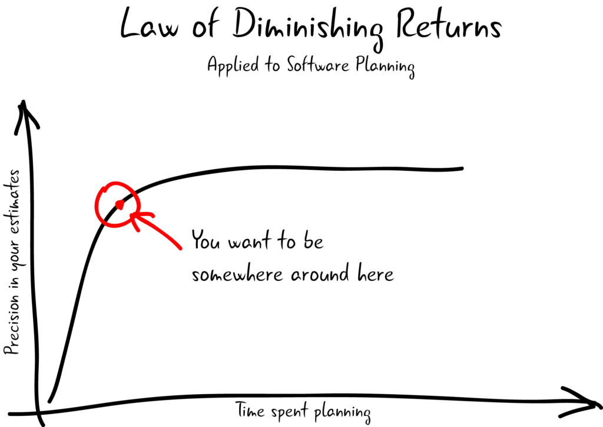

```{r setup, include=FALSE}
knitr::opts_chunk$set(echo = TRUE)
knitr::opts_knit$set(root.dir = '../..')
getwd()
```

Prior beginning, source all the required dependencies.

```{r, message=FALSE}
source('src/lib.R')
```

***

#The **data** you will be working with

<details>
<summary>Let's have a look</summary>
```{r}
get_full_dataset() %>%
  group_by(type) %>%
  summarise('mean_x' = mean(x),
            'sd_x' = sd(x),
            'mean_y' = mean(y),
            'sd_y' = sd(y))
```

##Pretty insightful, don't ya?

<details>
<summary>Indeed, most of the time, statistic do not tell anything about the **true nature** data you have.</summary>


***

<details>
<summary>Ok let's **get serious** and plot someting more meaningful</summary>

```{r}
get_full_dataset() %>% ggplot(aes(x = x, y = y, color = class)) +
  geom_point() + facet_wrap(~type) + scale_color_fivethirtyeight() + theme_fivethirtyeight() +
  labs(color = "") + theme(legend.position = "none")
```

### Woooooo!!1!11!!

***

<details>
<summary>Let's fit!</summary>

####Yes **but how**?
The cool think about **doing data science with a scripting language** is that you do not need to be neither a computer scientist nor a statistician to make someting.

```{r eval=FALSE}
library(caret)
```

Ofc knowing the theoretical underpinnings can be helpful but what you really need is to know which approach suits bettwr your problem... and you are done. 

<details>
<summary>You won't win a kaggle competition but you will get somewhere.</summary>




