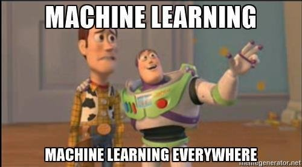

___

### 0.1 [Teaser Trailer](https://goo.gl/5rhLYK)

___

# **Session** *1*
#### *The Basics*

### 1.1 [Introduction to the Tidyverse](https://goo.gl/MWHjw4)
### 1.2 [Machine Learning Libraries in $\texttt{R}$](https://goo.gl/JQn9DB)
### 1.3 [K Nearest Neighbors](https://goo.gl/1CTbkX)
### 1.4 [Support Vector Machines](https://goo.gl/Ne75mZ)
### 1.5 [Tree-based Models](https://goo.gl/YaAi7s)
### 1.6 [*Titanic* Dataset](https://goo.gl/yv2R46)
___
# **Session** *2*
##### *Traning Strategies et al.*

### 2.1 [Bias-Variance Tradeoff](https://goo.gl/3bXPU6)
### 2.2 [Model Performance](https://goo.gl/yv2R46)
### 2.3 [Model Selection](https://goo.gl/YkMmvr)
### 2.4 [Hyperparameter Optimization](https://goo.gl/zGa4GR)
### 2.5 [*Credit Card Fraud* Dataset](https://goo.gl/dy7To6)
___

# **Session** *3*
##### *Deep Learning*

### 3.1 [Introduction to Neural Networks](https://goo.gl/JxUbRV)
### 3.2 [Convolutional Neural Networks](https://goo.gl/sGMK2D)
### 3.3 [Recurrent Neural Networks](https://goo.gl/imRcr1)
### 3.4 [Regularization Techniques](https://goo.gl/iAf2KU)
### 3.5 [Convnets for Text Recognition](https://goo.gl/Cnt5ta)

___

